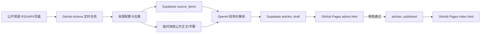

# 听见全球 AI 前沿：自动更新系统设计

## 目标

将现有静态前台升级为：

- 每天北京时间 08:00 和 20:00 检查重点频道；
- 只处理配置表中启用的公开频道；
- 每个自然日最多生成 10 条解读草稿；
- 只保存节目元数据、AI 解读和原始链接，不保存完整转录；
- 允许在任务运行时临时读取公开网页正文、公开字幕或 RSS 描述作为生成上下文；
- 所有草稿必须经过 `maojingling25@gmail.com` 登录审核后才能公开；
- 每篇解读生成 7-10 条结构化洞察，分别保存标题、核心论断、深层分析和战略价值；编辑解读至少 3 个自然段并达到深度分析长度要求；
- 每篇解读的 `guest_name` 必须指向该期访谈中实际输出核心观点的被访谈者或主要对谈者，`guest_intro` 只介绍这个人物本人；频道、播客、主持人和制作机构只能作为来源信息；
- GitHub Pages 承载公开前台和管理员审核页面；
- GitHub Actions 承载定时抓取和 OpenAI 调用。

## 架构



## 关键数据边界

- OpenAI API Key 只放在 GitHub Actions Secrets。
- Supabase Secret Key 只放在 GitHub Actions Secrets。
- Supabase Publishable Key 可以出现在静态前台，用 RLS 限制读权限。
- 完整转录不写入数据库，也不提交 GitHub。
- 临时读取的公开网页正文和字幕只进入本次 OpenAI 请求上下文，任务结束后不落库。
- `source_items.raw_payload` 只保存短的来源元数据，不能保存音频或全文转录。
- 文章详情页的嘉宾栏与正文“嘉宾介绍”章节都以 `guest_name` 为对象，不使用频道名代替嘉宾。
- `episode_url` 只保存具体单集页面，`play_url` 只保存音频直链或视频播放页；两者都为空时，前台显示待人工补充，不回退到来源频道主页。
- 公开用户只能读取 `status = 'published'` 的文章。
- 管理员身份以 Supabase Auth 会话和 JWT 邮箱断言为准。

## 运行时

- `index.html`：公开阅读和搜索筛选，同时把结构化洞察字段纳入搜索文本。
- `article.html`：优先渲染 `articles.insights` 的洞察卡片；没有该字段的旧文章使用 `key_points` 兼容渲染。
- `admin.html`：Magic Link 登录、草稿编辑、结构化洞察 JSON 校验、发布、拒绝和下线。
- `scripts/run-pipeline.mjs`：拉取 RSS、去重、临时读取公开正文、调用 OpenAI、写入草稿。
- `.github/workflows/content-pipeline.yml`：北京时间 08:00/20:00 触发。
- `.github/workflows/pages.yml`：推送到默认分支后发布静态站点。

## 当前限制

用户提供的是节目主页链接，不一定都是稳定 RSS/API 地址。配置文件中已完整登记频道，但只有补齐 `feed_url` 的频道才会进入自动抓取。

对于没有 RSS/API 的公开频道，后续需要为具体平台增加独立适配器。不能把不同平台统一当成一个页面来解析。

首批 Demo 优先接入公开 RSS/Atom 稳定的来源。小宇宙、Apple Podcasts 页面、部分官方博客和 YouTube 频道需要逐个验证公开入口。

## 审核状态

```text
draft -> published
draft -> rejected
published -> draft
```

公开前台永远只查询 `published`。

## 文章字段

`public.articles.insights` 是 JSONB 数组，格式如下：

```json
[
  {
    "title": "洞察标题",
    "claim": "核心论断，只有有依据时才使用逐字引号",
    "analysis": "背景、案例和逻辑推导",
    "value": "对产品、创业、研究、投资或组织决策的启发"
  }
]
```

流水线和后台发布校验都要求数组包含 7-10 条，且四个字段不能为空。完整转录仍不写入数据库；`content` 保存的是结构化解读文章。
